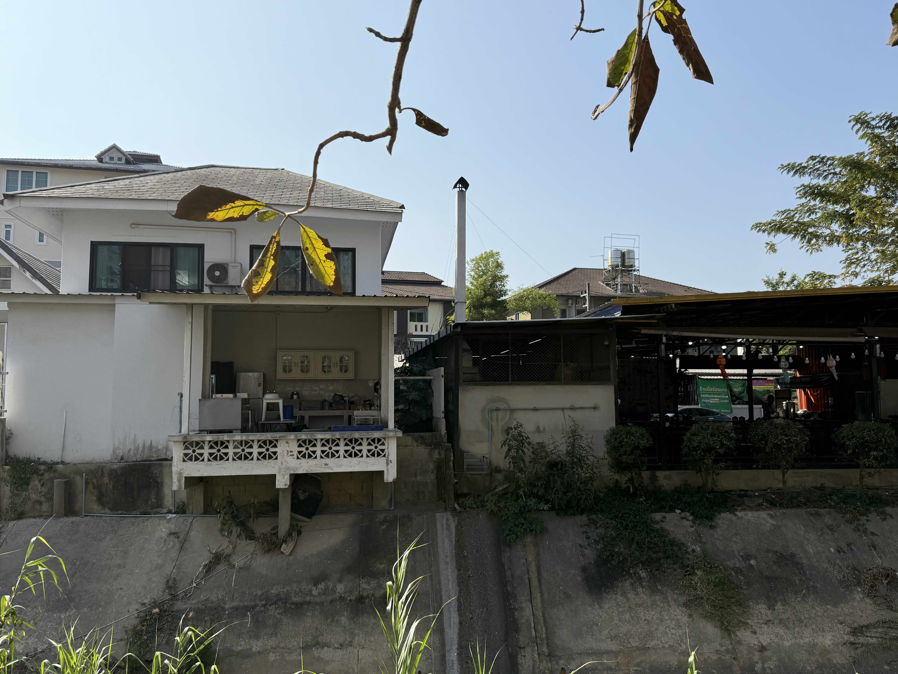

# 20250201_chiangrai

<html>
<head>

<meta charset="UTF-8">
<meta http-equiv="Content-Type" content="text/html; charset=UTF-8">
<meta http-equiv="X-UA-Compatible" content="IE=EmulateIE10" />
<meta http-equiv="X-UA-Compatible" content="IE=edge">

<!--ここから上はお決まりの定型文です-->

<!--ここからが表現の書式などを決めるcssという部分-->

<link href="https://cdnjs.cloudflare.com/ajax/libs/lightbox2/2.7.1/css/lightbox.css" rel="stylesheet">

</head>

<body>

モバイル端末をお使いの場合は、画面を横向きにすると
より見やすくご覧頂けます。

<!--ここ上は、ほぼそのまま使います！-->

<!--QRコードの挿入例-->

 アクセス用QRコード

<marquee direction="left" scrollamount="20" width="30%">(^_^)/~alis</marquee>

<!--流れ文字の挿入例-->
<h1><marquee behavior="left">!!! 2025/02/01、日の出前の空で夏の星座観察、いつもの大学でプールなど!!!</marquee></h1>

                          

<!--ここから下が、本体部分-->

<h2>夜明け前の東の空には夏の星座 朝5:32 前回一部が木の影に入ったさそり座も全部見えました</h2>

    
<h2>日の出も綺麗です 朝7:14</h2>

    
<h2>地方選挙の投票も終わり、立候補者が配ったお小遣いで焼肉買ってパーティー</h2>

    
<h2>日本だったら大ニュースですが、No無しのバイクが走るタイではごく日常</h2>

    
<h2>午後は先週のネコのシャンプーしたお店で、ちょっとトリミング</h2>

    
<h2>横の木の下にあった仏壇は、今日も見事に祀られていました</h2>

    
<h2>メーファールーアン大学の学生さんが飼い猫を預けに来てました 卒業前の８ヶ月海外研修で不在になるためでした</h2>

    
<h2>ネコのトリミングのお店の川を挟んだ向かい側には、先週気づかなかったお店がいくつか見えます</h2>

    
<h2>白は普通の民家ですが、台所がオープンで川を眺めながら食事できます</h2>

    
<h2>ちょっと離れたペットショップのお客さんも、いかにも学生さんという若さ</h2>

    
<h2>街中を走るバイクのライダーもみな若者</h2>

    
<h2>うちの猫ちゃんは、尻尾がハタキみたいになりました</h2>

<h2>その大学のプールで軽く水泳</h2>

    
<h2>入り口の花壇はいつもながら見事なお花</h2>

    
<h2>土曜日お昼は水泳教室で、３組のチームが練習中</h2>

    
<h2>この日は雲ひとつない青空でした</h2>

    
<h2>最後に花壇のお花をアップで撮りましたが プールから道を隔てた学内の公園にもお花が咲き誇ってました</h2>

    
<h2>熱帯の陽射しで、畑の作物まで輝いて見えます</h2>  

    
<h2>大学入り口の生垣は、綺麗に刈られています</h2>

    
<h2>学生さんたちのバイクと一緒に退出</h2>

    
<h2>コンビニで買ったアイスは50バーツ、屋台でラーメンが食べられるお値段</h2>

    
<h2>荷台乗車はよく見るけど、荷台の荷物の上はかなり危険では？</h2>

    
<h2>流石にこれは取り締まり対象とのことでした</h2>

    
<h2>ショッピングモールに長時間駐車したと思われる車のドアに、商品広告の紙</h2>

    
<h2>ショッピングモールの食堂で使う食器棚</h2>

<h2>食器は左上の熱湯で消毒してから使います</h2>

    
<h2>ラーメンのトッピングも完全につゆに沈めて、雑菌除去してから美味しくいただきます</h2>

    
<h2>ガソリン給油してから帰路につきました</h2>

    
<h2>知り合いが川で釣り上げた大物を売りに来ました 40BT/kg、8kgを320バーツで購入</h2>

<h2>夕焼けグラデーションに細い月が浮かびました 金星との距離も近づいて綺麗なので画像は全部あげました この先のデータはやや重めなので読み込みに時間がかかるかも</h2>

<h2>今日のBGMはちょっとシックな洋楽で</h2>
<iframe width="560" height="315" src="https://www.youtube.com/embed/vhi7DPRDVfM?si=lJ88xLeJdPwXmJrf" title="YouTube video player" frameborder="0" allow="accelerometer; autoplay; clipboard-write; encrypted-media; gyroscope; picture-in-picture; web-share" referrerpolicy="strict-origin-when-cross-origin" allowfullscreen></iframe> 

   
<h2>以上、夜明け前の星空でスタートした一日 大学周辺でネコのトリミングしてプール、最後は夕焼けグラデーションでした ここまで観ていただきありがとうございました。</h2>

     
<h2>
<a href="https://torokoid.github.io/20241126_chiangrai/" target="_blank">Back to the menu page</a>
</h2>

   

         

  

      

<!--本体はここまで-->

<!--画面に空白地帯を作って、背景が見えるようにしています-->
                                              

<!-- フッタ -->
<footer>

Copyright 2025/02/02 alis @ChiangRai

</footer>

<!--HPにさまざまなJavaScriptを呼び込むための書式-->

